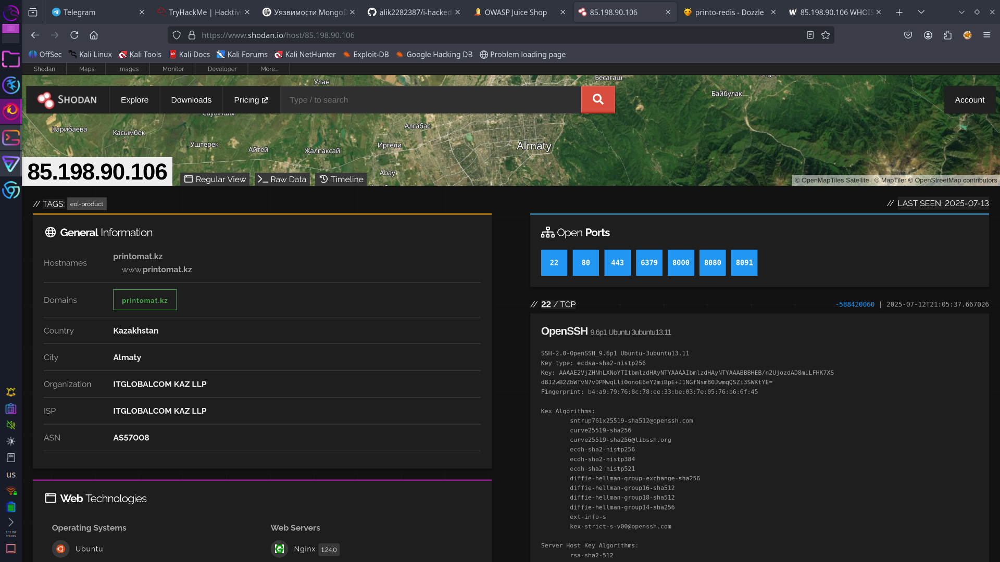
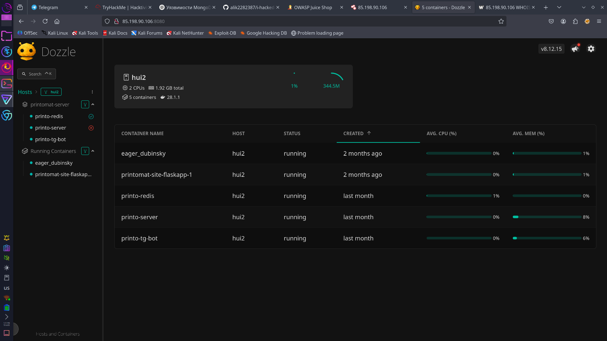
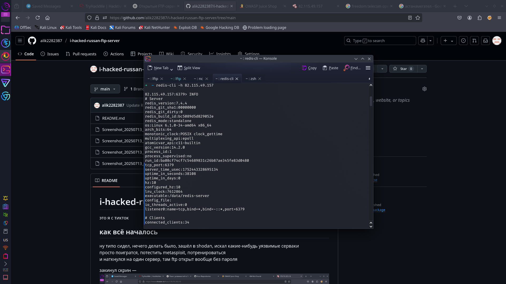
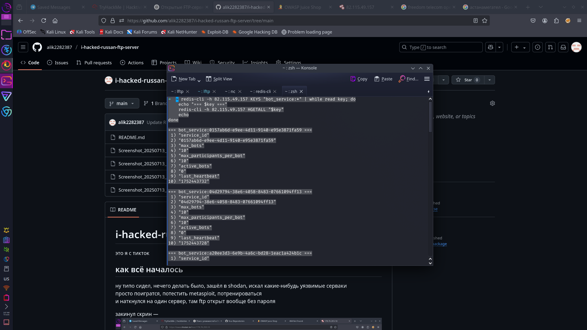
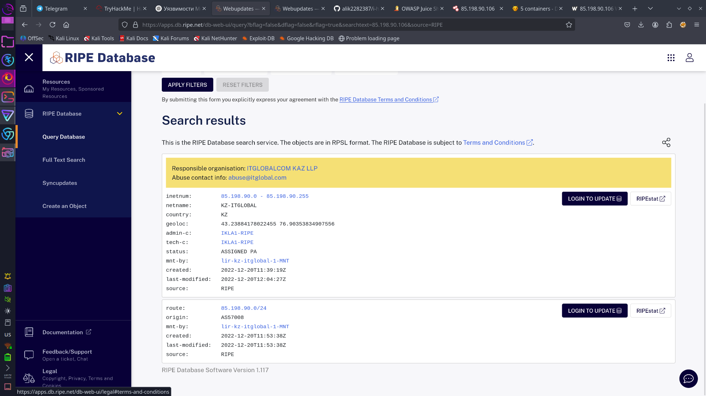
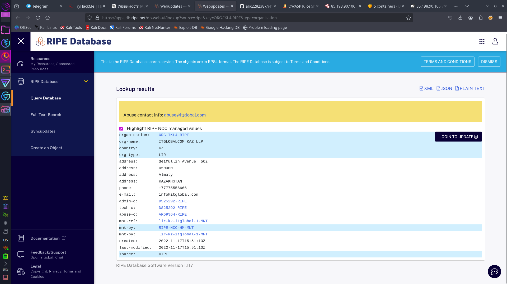

# itglobalcom-kaz

уящвимости нашел
---

## 🚀 Как всё началось

Я как обычно сидел в Shodan и искал уязвимые машины с `"SimpleHTTP/0.6"`, чтобы потестить, поиграться и вообще поучиться.

И тут вдруг вот оно чудаюда

айпи оказался из диапазона организации **ITGLOBALCOM KAZ LLP**.

---

## 🔍 Что было дальше

Решил зайти по адресу:  
**http://85.198.90.106:8080/**

А там Dozzle Логи контейнеров в открытом доступе:

Вот что там крутится:

| Контейнер                | Хост  | Статус    | Когда создан   |
|--------------------------|-------|-----------|----------------|
| eager_dubinsky           | hui2  | 🟢 running | 2 месяца назад |
| printomat-site-flaskapp-1| hui2  | 🟢 running | 2 месяца назад |
| printo-redis             | hui2  | 🟢 running | месяц назад    |
| printo-server            | hui2  | 🟢 running | месяц назад    |
| printo-tg-bot            | hui2  | 🟢 running | месяц назад    |

---

## 🧨 Redis без авторизации

Решил попробовать подключиться к Redis — и получилось Без пароля вообще.

  

Внутри были разные данные, что-то связанное с ботом — сначала подумал, что это ботнет или что-то связанное с автоматикой.

---

## 🏢 Кто такие ITGLOBALCOM KAZ LLP?

Решил пробить, кто владелец IP:

  

Нашёл контакты, написал им письмо и приложил архив со всеми найденными уязвимостями.

---

## ✅ Вывод

Найдена:
- открытая панель логов Dozzle,
- контейнеры с Redis и Telegram-ботом,
- Redis открыт без пароля.

Я сообщил им. Надеюсь, поправят.

✌️ Всё, всем пока.
